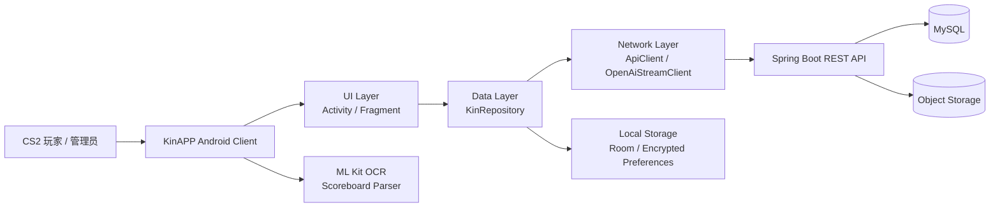

# KinAPP

> 面向 CS2 玩家社区的 Android 原生应用：沉淀道具点位、战术方案、对局数据与社区互动，让游戏经验可以被检索、收藏、审核和复用。

[](https://developer.android.com/)
[](https://openjdk.org/)
[](https://gradle.org/)
[](app/build.gradle)
[](app/build.gradle)
[](release-notes/KinAPP-Beta1.0.21.md)

## 项目简介

KinAPP 是一个围绕 Counter-Strike 2 玩家资料管理与社区协作构建的移动端应用。项目以 Android 原生 Java 客户端为主体，配合 Spring Boot 后端接口，覆盖用户认证、论坛内容、道具/战术分享、评论互动、收藏库、站内信、留言板、签到成长、举报治理、管理员审核、记分板 OCR 与 AI 推荐等功能。

它不是游戏外挂或对局干预工具，而是一个信息管理与辅助复盘工具：玩家可以把道具点位、战术执行、日常讨论和对局截图识别结果沉淀为结构化内容，并通过审核、收藏、搜索和互动机制形成可维护的 CS2 知识社区。

## 功能亮点

| 模块 | 能力 |
| --- | --- |
| 用户体系 | 登录、注册、会话持久化、记住登录、角色区分 |
| 内容社区 | 道具分享帖、战术分享帖、日常讨论帖、分页列表、详情页 |
| 发布编辑 | 多类型动态表单、图片上传、草稿保存、Markdown 内容渲染 |
| 搜索发现 | 关键词搜索、地图筛选、帖子类型筛选、热词与搜索建议 |
| 互动沉淀 | 点赞、评论、收藏库、个人主页、站内信、留言板 |
| 移动端特色 | 基于 Google ML Kit 的 CS2 记分板 OCR 与结构化解析 |
| AI 辅助 | OpenAI-compatible 流式客户端、可配置模型供应商、战术建议入口 |
| 成长体系 | 每日签到、等级、经验值、个人中心进度展示 |
| 内容治理 | 帖子审核、评论审核、举报处理、审核模板、审计日志 |
| 扩展能力 | Future 功能中心、异步任务、预留内容/社区/AI/运营等能力入口 |

## 技术栈

### Android 客户端

- Java 11
- Android Gradle Plugin 9.1
- minSdk 31 / targetSdk 35 / compileSdk 35
- AndroidX AppCompat、Fragment、Activity、ViewPager2、SwipeRefreshLayout
- Material Components
- Room 2.6.1
- AndroidX Security Crypto
- Google ML Kit Text Recognition + Chinese Text Recognition
- Markwon Markdown Renderer
- JUnit4 + AndroidX Test + Espresso

### 后端接口协作

本仓库主要保存 Android 客户端工程，同时在 `app/src/main/Class_Explanation/` 中保留后端接口与业务说明文档。客户端按 RESTful API 与 Spring Boot 后端通信，典型后端能力包括：

- JWT 鉴权：`Authorization: Bearer <token>`
- 用户注册、登录、刷新令牌
- 论坛帖子、评论、图片、搜索、点赞、收藏
- 草稿、站内信、留言板、举报、签到
- 管理员审核、举报处理、审计日志
- OSS 图片存储与 OpenAI-compatible AI 能力

## 架构概览



## 客户端目录结构

```text
app/src/main/java/com/example/kin/
├── MainActivity.java                  # 主容器，ViewPager2 + 底部导航
├── ui/                                # 页面层
│   ├── LaunchActivity.java            # 启动页与登录态判断
│   ├── AuthActivity.java              # 登录 / 注册
│   ├── HomeFragment.java              # 论坛首页、筛选、热词、搜索入口
│   ├── PublishEditorActivity.java     # 多类型发布编辑器
│   ├── PostDetailActivity.java        # 帖子详情、评论、点赞、收藏、图廊
│   ├── AiRecommendFragment.java       # OCR + AI 推荐
│   ├── LibraryFragment.java           # 收藏库
│   ├── ProfileFragment.java           # 个人中心
│   ├── admin/                         # 管理员中心
│   ├── common/                        # 通用 UI、图片加载、等级视觉
│   └── future/                        # 预留功能中心
├── data/                              # 仓库、本地草稿、会话、AI 配置
│   └── local/                         # Room Database / DAO / Entity
├── net/                               # HTTP 客户端、异常、回调、流式 AI
├── model/                             # DTO / 页面模型 / 业务模型
├── util/                              # 线程、JSON、时间、OCR 编排与解析
└── update/                            # GitHub Release 更新检查
```

## 核心数据流

1. 用户从 `LaunchActivity` 进入应用，客户端通过 `SessionManager` 检查本地会话。
2. UI 页面调用 `KinRepository`，由仓库层统一组织 API 路径、请求体和回调。
3. `ApiClient` 负责 GET/POST/PUT/PATCH/DELETE、multipart 上传、Bearer Token 注入和错误处理。
4. 后端返回 JSON 后，`JsonUtils` 转换为 `model/` 下的数据模型。
5. 会话、草稿等本地状态由 Room 持久化，AI 配置由安全存储管理。
6. 记分板图片由 ML Kit 识别，`ScoreboardOcrOrchestrator` 重建文本结构，`ScoreboardParser` 提取比分、地图、经济与 KDA。

## 快速开始

### 环境要求

- Android Studio Narwhal 或更新版本
- JDK 17（项目 `gradle.properties` 默认指向 `C:\Program Files\Java\jdk-17`）
- Android SDK 35
- 可访问 Google Maven 与 Maven Central

### 克隆项目

```bash
git clone https://github.com/L-kin-trim/KinAPP.git
cd KinAPP
```

### 构建 Debug 包

```powershell
.\gradlew.bat assembleDebug
```

### 运行单元测试

```powershell
.\gradlew.bat testDebugUnitTest
```

### 在 Android Studio 中运行

1. 使用 Android Studio 打开项目根目录。
2. 等待 Gradle Sync 完成。
3. 选择 `app` 配置。
4. 连接 Android 12 及以上设备或模拟器。
5. 点击 Run。

## 后端配置说明

客户端通过 `SessionManager` 和 `ApiClient` 调用后端 REST API。开发或部署时请确认：

- 后端服务可访问，且接口与 `app/src/main/Class_Explanation/APP_Complete_API.md` 中的契约保持一致。
- 登录接口返回客户端需要的 token 与用户信息。
- 受保护接口支持 `Authorization: Bearer <token>`。
- 图片上传、帖子审核、收藏、消息、举报、签到等接口已部署。
- 生产环境建议使用 HTTPS，并将后端地址迁移到构建配置、远程配置或安全的环境注入方式中。

> 注意：不要将数据库密码、JWT 密钥、OSS AccessKey、AI API Key 或生产服务器敏感信息提交到仓库。

## AI 与 OCR

### OCR

KinAPP 使用 Google ML Kit 在设备端完成记分板文字识别。识别结果会经过几何行重建和规则解析，尽量从复杂截图中提取：

- 地图名称
- 比分
- 玩家名称
- 击杀 / 死亡 / 助攻
- 经济信息
- 伤害与热点玩家摘要

相关代码：

- `util/ScoreboardOcrOrchestrator.java`
- `util/ScoreboardParser.java`
- `model/ScoreboardSnapshot.java`
- `app/src/test/java/com/example/kin/ScoreboardParserTest.java`

### AI 推荐

AI 能力通过 OpenAI-compatible 接口实现，客户端提供多个供应商预设并支持用户配置：

- 通义千问
- OpenAI
- Claude compatible route
- 豆包
- DeepSeek

相关代码：

- `ui/AiRecommendFragment.java`
- `ui/AiSettingsActivity.java`
- `data/AiConfigStore.java`
- `model/AiProviderPreset.java`
- `net/OpenAiStreamClient.java`

## 测试覆盖

当前单元测试重点覆盖：

- 记分板 OCR 文本解析：`ScoreboardParserTest`
- AI 流式响应解析：`OpenAiStreamClientTest`
- AI 配置有效性：`AiConfigTest`
- Future 功能注册表：`FutureFeatureRegistryTest`
- 预留功能错误契约：`FutureFeatureErrorContractTest`

运行：

```powershell
.\gradlew.bat testDebugUnitTest
```

## 版本发布

当前版本：

- versionName: `KinAPP Beta1.0.21`
- versionCode: `121`
- APK 输出示例：`output/KinAPP-Beta1.0.21.apk`
- 更新说明：[`release-notes/KinAPP-Beta1.0.21.md`](release-notes/KinAPP-Beta1.0.21.md)

## 文档索引

- [`CODE_UPDATE_LOG.md`](CODE_UPDATE_LOG.md)：代码更新记录与项目总览
- [`app/src/main/Class_Explanation/APP_Complete_API.md`](app/src/main/Class_Explanation/APP_Complete_API.md)：APP 对接 API 文档
- [`release-notes/`](release-notes/)：版本更新记录

本地开发资料中还包含 Future 功能规划与后端扩展接口规划，可作为后续迭代参考；发布到仓库时请确认对应文档已纳入版本控制后再添加链接。

## 安全说明

- 本仓库不应包含真实生产密钥。
- AI API Key 应保存在本地安全存储或后端代理服务中。
- 生产环境建议关闭明文流量，统一使用 HTTPS。
- 管理端接口必须在后端强制校验管理员角色。
- 举报、审核、删除、审计等治理操作应保留可追溯记录。

## 许可证

当前仓库未声明开源许可证。未经作者明确授权，请勿将代码用于商业分发或二次发布。
